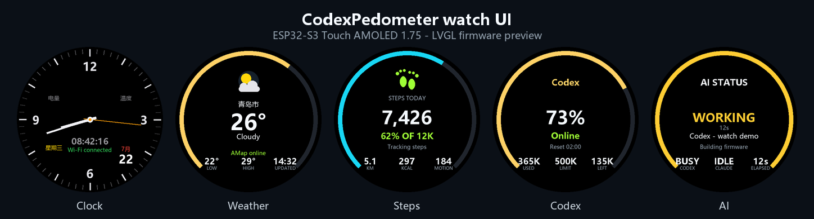

<div align="center">
  <h1>ESP32-S3-Touch-AMOLED-1.75</h1>
  <p><strong>ESP32-S3 1.75-inch 466 x 466 QSPI AMOLED touch development board</strong></p>
  <p>
    <a href="https://github.com/waveshareteam/ESP32-S3-Touch-AMOLED-1.75/actions/workflows/examples.yml"></a>
    <a href="https://github.com/waveshareteam/ESP32-S3-Touch-AMOLED-1.75/releases/latest"></a>
    <a href="LICENSE"></a>
  </p>
  <p>
    <a href="https://www.waveshare.com/esp32-s3-touch-amoled-1.75.htm">🌐 Product Page</a> ·
    <a href="https://github.com/waveshareteam/ESP32-S3-Touch-AMOLED-1.75/releases/latest">📦 Firmware Releases</a> ·
    <a href="examples/esp-idf/">🧩 ESP-IDF Examples</a> ·
    <a href="examples/arduino/">🔧 Arduino Examples</a> ·
    <a href="docs/">📚 Documentation</a>
  </p>
  <p>
    
  </p>
</div>

---

## ✨ 项目概览 / Overview

这是基于微雪 Waveshare `ESP32-S3-Touch-AMOLED-1.75` 开发板整理的开源工程。
仓库保留官方示例、原理图、固件资料，并新增一个完整的 ESP-IDF 智能手表风格
Demo：`11_CodexPedometer`。

This repository is based on the Waveshare `ESP32-S3-Touch-AMOLED-1.75`
development board. It keeps the original examples, schematics, firmware notes,
and adds a full ESP-IDF watch-style demo named `11_CodexPedometer`.

The board combines an ESP32-S3 with a high-resolution AMOLED display,
capacitive touch, motion sensing, power management, real-time clock, audio,
and storage interfaces in a compact development platform.

## CodexPedometer 智能手表 Demo / Smart Watch Demo

Demo 入口：
[`examples/esp-idf/11_CodexPedometer`](examples/esp-idf/11_CodexPedometer/)

它把这块 1.75 英寸圆形 AMOLED 开发板做成一个小型桌面手表/状态屏，目前包含：

- 时间表盘：NTP 同步、中文日期、模拟指针
- 天气页面：通过高德 Web 服务获取城市天气
- 计步页面：使用 QMI8658 计步，显示距离、热量、运动量
- Codex 额度页面：通过本机 bridge 查询 Codex 用量/额度
- AI 状态页面：显示 Codex / Claude 是否工作、等待用户、出错或完成
- 手机配网页面：设备热点 `CodexPedometer` + `http://192.168.4.1`
- Windows 本地桥接服务：Codex 用量、AI agent 状态、hook 事件记录

Recent changes include the AI status page, smooth breathing/blinking status
lights, diagnostic hook logging, duplicate bridge-instance protection, hidden
startup launch, Codex project-name reporting, and cleaner waiting/error/done
states.

### 快速开始 / Quick Start

推荐使用 ESP-IDF `v6.0.2` 或更新版本。打开 ESP-IDF 终端后：

```powershell
cd examples\esp-idf\11_CodexPedometer
idf.py set-target esp32s3
idf.py build
idf.py -p COM4 flash monitor
```

把 `COM4` 换成你的开发板串口。VS Code 用户建议直接打开
`examples/esp-idf/11_CodexPedometer` 这个工程目录，选择 target `esp32s3`，
再使用 ESP-IDF 插件的 Build / Flash。

Replace `COM4` with your board port. In VS Code, open
`examples/esp-idf/11_CodexPedometer` directly, select target `esp32s3`, then use
the ESP-IDF Build / Flash commands.

### 设备配网页面 / Device Setup Portal

首次启动时，固件会开启一个开放热点：

```text
CodexPedometer
```

手机或电脑连接这个热点后，打开：

```text
http://192.168.4.1
```

页面里可以配置：

- Wi-Fi 名称和密码
- 天气城市，例如 `青岛市`、`上海市`，或高德 adcode，例如 `370200`
- 高德 Web 服务 Key
- Codex 用量 bridge URL
- AI agent 状态 bridge URL
- 计步目标步数

这些值会保存到 NVS，后续重启仍然有效。正常使用不需要把私人 Wi-Fi 密码写进
源码。默认占位配置在：
[`app_config.h`](examples/esp-idf/11_CodexPedometer/main/app_config.h)

The setup portal saves values into NVS, so users normally do not need to edit
private Wi-Fi credentials into the firmware source.

### Codex 用量桥 / Codex Usage Bridge

Codex 额度页面会轮询电脑上的本地 HTTP bridge。启动方式：

```powershell
python tools\codex_usage_server.py
```

默认监听：

```text
http://<your-pc-lan-ip>:8765/usage
```

这个 bridge 会优先通过 Codex Desktop 的 `codex app-server --stdio` 读取真实
Codex rate limit / usage 信息。如果当前环境读不到真实数据，会回退到
[`tools/codex_usage.json`](tools/codex_usage.json)，方便开发调试。

然后在设备配网页面的 Codex URL 中填入：

```text
http://<your-pc-lan-ip>:8765/usage
```

The bridge reads real Codex account data when available and falls back to a
local JSON file for predictable development behavior.

### AI 状态桥 / AI Agent Status Bridge

AI 状态页会轮询：

```text
http://<your-pc-lan-ip>:8766/status
```

手动启动：

```powershell
python tools\agent_status_server.py
```

设置为 Windows 登录后自动启动：

```powershell
python tools\agent_status_server.py --install
```

取消自启动：

```powershell
python tools\agent_status_server.py --uninstall
```

自启动安装逻辑：

- 优先创建 Windows 计划任务 `AgentStatusBridge`
- 如果权限不足，则回退到启动文件夹里的隐藏 `.vbs` 启动器
- 运行日志写入 `tools/agent_status.log`，该文件已被 Git 忽略
- 如果重复启动，第二个实例会拒绝监听端口，避免 hook 事件被多个进程抢走

打印 hook 配置示例：

```powershell
python tools\agent_status_server.py --print-hooks
```

Codex hook 可以调用：

```text
py -3 tools\codex_hook.py --state working
py -3 tools\codex_hook.py --state done
```

Claude Code 用户可以把 `--print-hooks` 打印出的 JSON 合并到
`~/.claude/settings.json`。支持状态：`idle`、`working`、`waiting`、`error`、
`done`。

For English readers: run `python tools\agent_status_server.py --print-hooks` for
ready-to-copy Claude Code hook snippets. Codex and other tools can report state
through `tools\codex_hook.py` or by calling `/event` directly.

### 开源配置注意事项 / Open Source Notes

请不要提交个人 Wi-Fi 密码、高德 Key、Codex bridge 内网 IP、运行日志或截图。
这类信息请通过 `192.168.4.1` 配网页面写入设备 NVS，或仅保存在本地未提交配置中。
仓库里的默认值都是占位符。

Do not commit personal Wi-Fi passwords, AMap keys, bridge IPs, runtime logs, or
captured screenshots. The committed defaults are placeholders by design.

## 🖥️ Hardware Overview

| Feature | Device / interface |
| --- | --- |
| MCU | ESP32-S3 with 16 MB flash |
| Display | 1.75-inch 466 x 466 QSPI AMOLED |
| Touch | CST9217 capacitive touch controller with two-point support |
| Power management | AXP2101 |
| Motion sensor | QMI8658 six-axis IMU |
| Real-time clock | PCF85063 |
| Audio | Dual onboard digital microphones and ES8311 codec support |
| Storage | microSD card interface |
| Expansion example | External LC76G GNSS module over I2C |
| Board support | Managed component: `waveshare/esp32_s3_touch_amoled_1_75` |
| Hardware files | [Product wiki](https://www.waveshare.com/wiki/ESP32-S3-Touch-AMOLED-1.75) and [schematics](Schematic/) |

## 📦 Firmware Releases

The fastest way to try an example is to use a ready-to-flash package from the
[latest release](https://github.com/waveshareteam/ESP32-S3-Touch-AMOLED-1.75/releases/latest).

1. Download the `*-combined.zip` package for the example and framework version
   you need.
2. Extract the archive and install esptool with
   `python -m pip install esptool`.
3. Connect the board over USB.
4. Run `flash_combined.bat COMx` on Windows or
   `./flash_combined.sh /dev/ttyACM0` on Linux.
5. Reset the board if it does not restart automatically.

> [!NOTE]
> Combined images are flashed at offset `0x0`. Each package also contains the
> original split binaries, flash arguments, helper scripts, and checksums.

Factory recovery images under [firmware](firmware/) are separate from
CI-generated example firmware. See
[Firmware and Factory Recovery](docs/firmware.md) for details.

## 🧪 Examples

### ESP-IDF

| Example | Focus |
| --- | --- |
| [01_AXP2101](examples/esp-idf/01_AXP2101/) | Power management, charging, and battery telemetry |
| [02_lvgl_demo_v9](examples/esp-idf/02_lvgl_demo_v9/) | LVGL 9 display benchmark |
| [03_esp-brookesia](examples/esp-idf/03_esp-brookesia/) | ESP-Brookesia phone-style application UI |
| [04_Immersive_block](examples/esp-idf/04_Immersive_block/) | Motion-controlled falling-block demo |
| [05_Spec_Analyzer](examples/esp-idf/05_Spec_Analyzer/) | Microphone FFT spectrum analyzer |
| [11_CodexPedometer](examples/esp-idf/11_CodexPedometer/) | Watch UI, pedometer, weather, Codex quota, AI status bridge |

### Arduino

| Example | Focus |
| --- | --- |
| [01_HelloWorld](examples/arduino/01_HelloWorld/) | Display bring-up and text output |
| [02_GFX_AsciiTable](examples/arduino/02_GFX_AsciiTable/) | GFX text and character rendering |
| [03_LVGL_PCF85063_simpleTime](examples/arduino/03_LVGL_PCF85063_simpleTime/) | LVGL real-time clock interface |
| [04_LVGL_QMI8658_ui](examples/arduino/04_LVGL_QMI8658_ui/) | LVGL accelerometer and gyroscope interface |
| [05_LVGL_AXP2101_ADC_Data](examples/arduino/05_LVGL_AXP2101_ADC_Data/) | LVGL power and battery telemetry |
| [06_LVGL_Widgets](examples/arduino/06_LVGL_Widgets/) | LVGL music UI, touch input, and IMU integration |
| [07_LVGL_SD_Test](examples/arduino/07_LVGL_SD_Test/) | microSD access through an LVGL application |
| [08_ES8311](examples/arduino/08_ES8311/) | ES8311 audio path and LVGL interface |
| [09_LC76G_I2C](examples/arduino/09_LC76G_I2C/) | External LC76G GNSS over I2C |
| [10_Touch_CST9217](examples/arduino/10_Touch_CST9217/) | Raw interrupt-driven single- and two-point touch diagnostics |

Bundled Arduino libraries live under
[`examples/arduino/libraries`](examples/arduino/libraries/). Their upstream
library examples are intentionally excluded from the product CI matrix.

## 🛠️ Supported Toolchains

| Surface | Version | Firmware builds |
| --- | --- | ---: |
| ESP-IDF | `v5.5.4` | 5 |
| ESP-IDF | `v6.0.2` | 5 |
| Arduino-ESP32 | `3.3.10` | 10 |

The [Build Examples workflow](https://github.com/waveshareteam/ESP32-S3-Touch-AMOLED-1.75/actions/workflows/examples.yml)
runs two discovery jobs and 20 firmware build jobs. Each successful build is
packaged as a flashable firmware artifact. Bundled library examples and factory
recovery binaries are intentionally excluded. See
[Continuous Integration](docs/ci.md) for matrix and dispatch details.

The historical v1.0.1 release predates `10_Touch_CST9217` and contains 19
firmware packages.

## 🗂️ Repository Layout

| Path | Purpose |
| --- | --- |
| [`examples/esp-idf/`](examples/esp-idf/) | First-party ESP-IDF projects |
| [`examples/arduino/`](examples/arduino/) | First-party Arduino sketches and bundled libraries |
| [`firmware/`](firmware/) | Factory flashing and recovery binary |
| [`releases/`](releases/) | Packaging, artifact download, and release tools |
| [`config/`](config/) | Shared ESP-IDF compatibility overlays |
| [`docs/`](docs/) | Setup, example, CI, component, firmware, and troubleshooting notes |
| [`Schematic/`](Schematic/) | Public schematic files |
| [`scripts/`](scripts/) | CI example discovery helpers |
| [`.github/`](.github/) | GitHub Actions and contribution templates |

## 📚 Documentation

- [Getting Started](docs/getting-started.md)
- [Example Catalog](docs/examples.md)
- [Repository Structure](docs/repository-structure.md)
- [Troubleshooting](docs/troubleshooting.md)
- [Firmware and Factory Recovery](docs/firmware.md)
- [Continuous Integration](docs/ci.md)
- [Components](docs/components.md)
- [Release Tools](releases/README.md)
- [Changelog](CHANGELOG.md)

## 🤝 Support and Contributions

Contributions and reproducible issue reports are welcome. Include the example
path, framework version, reproduction steps, expected behavior, actual
behavior, and relevant serial logs.

- [Contributing Guide](CONTRIBUTING.md)
- [Support](SUPPORT.md)
- [Security Policy](SECURITY.md)
- [Open an Issue](https://github.com/waveshareteam/ESP32-S3-Touch-AMOLED-1.75/issues/new/choose)

## 📄 License

This repository is licensed under the Apache License 2.0. See
[LICENSE](LICENSE).
