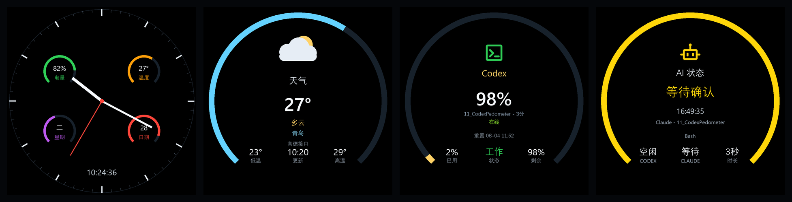
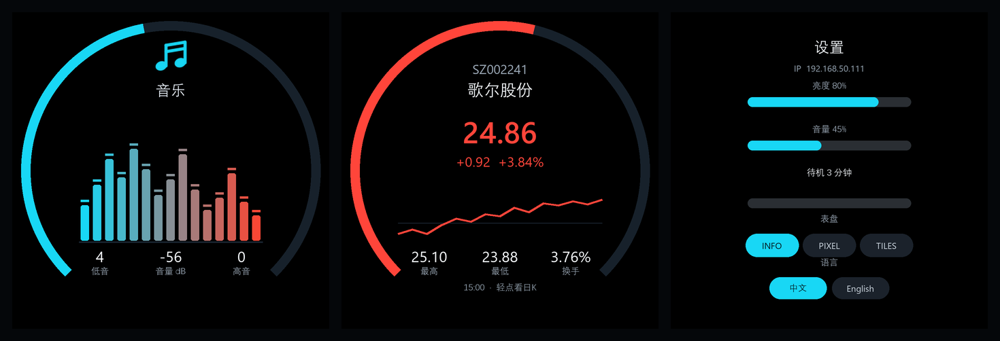
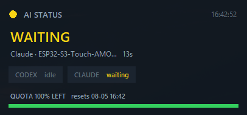

# Codex Pedometer

A multi-page smartwatch UI for the ESP32-S3-Touch-AMOLED-1.75: analog watch faces,
weather, step counting, Codex quota, AI agent status, a microphone spectrum and a
stock ticker — switchable between Chinese and English.





> The images are renderings produced by `tools/render_docs_shots.py` from the same
> geometry and colours the firmware uses, not photographs of the panel.

## Pages

Swipe left/right to change page; swipe down from the top for settings.

| Page | What it shows |
| --- | --- |
| Clock | Analog hands plus a digital readout. Three faces — INFO, PIXEL, TILES — and four tappable corner complications that cycle through battery, temperature, weekday, date, weather, Codex quota and AI state. |
| Weather | Current conditions from AMap, today's low/high, and a 4-day forecast detail page behind the weather icon. |
| Steps | QMI8658 step count against a configurable goal, with distance, calories and activity. |
| Codex | Remaining quota as the headline, plus Codex's own working state: the icon takes the state colour, one column carries the state word, and a line names the project it is running. |
| AI status | Codex and Claude Code state from the PC bridge — idle, working, waiting for approval, error, done — with a breathing ring that replaces a desk status lamp. |
| Music | Microphone spectrum with a VU ring, and bass / volume / treble readouts. |
| Stock | Live quotes for a configurable watchlist, an intraday trace, and 20-day candles behind a tap. Red for up, green for down. |

## Hardware

- ESP32-S3-Touch-AMOLED-1.75 (466x466 round CO5300 QSPI AMOLED)
- CST9217 capacitive touch
- QMI8658 IMU (steps)
- ES7210 microphone (spectrum)
- AXP2101 PMU (battery)

## Supported versions

- ESP-IDF `v6.0.2`
- Target `esp32s3`

## Build and flash

From the repository root with ESP-IDF activated:

```bash
idf.py -C examples/esp-idf/11_CodexPedometer set-target esp32s3 build
```

```bash
idf.py -C examples/esp-idf/11_CodexPedometer -p COM4 flash monitor
```

The app partition is 8 MB (`partitions.csv`) because the bundled GB2312 fonts are
large; the board has 16 MB, so this only claims unused space. A 512 KB `wallpaper`
partition follows the app.

## First-time setup

1. On first boot the device brings up a `CodexPedometer` softAP.
2. Join it and open `http://192.168.4.1/`.
3. The page configures Wi-Fi, the weather city and AMap key, the step goal, the
   stock watchlist (`sz002241:歌尔股份,hk09903:天数智芯`), the ring colours, the
   watch face and the interface language.
4. Once Wi-Fi is up the same page is reachable at the device's LAN address, which
   the settings panel shows.

Credentials can also be compiled in: copy the placeholders from `main/app_config.h`
into `main/app_config_local.h` (gitignored) and fill them in.

## PC bridge

`tools/agent_status_server.py` feeds the Codex, AI status and stock pages from a
machine on the same LAN:

| Endpoint | Serves |
| --- | --- |
| `:8765/usage` | Codex quota |
| `:8766/status` | Codex / Claude Code agent state |
| `:8766/stock?code=` | Intraday and daily series — the public chart endpoints redirect to HTTPS, which this build cannot reach |

```bash
python tools/agent_status_server.py --install-autostart
```

Agent state is pushed by hooks: Claude Code posts to the bridge natively, Codex
through `tools/codex_hook.py` registered in `~/.codex/hooks.json`.

## Desktop widget

The same data, as a frameless always-on-top panel for the desktop - useful when
the watch is not in front of you:

```bash
python tools/agent_widget.py
```



Drag it anywhere (the position is remembered), right-click for opacity and
always-on-top, `--host` if the bridge runs on another machine, and
`--install-autostart` to start it at logon. Standard library only.

## Assets

Regenerate rather than hand-edit:

```bash
python tools/build_cjk_font.py --size 16
```

```bash
python tools/build_ui_icons_extra.py --preview
```

```bash
python tools/make_wallpapers.py
```

```bash
python tools/set_wallpaper.py wallpapers/aurora_nebula.png
```

```bash
python tools/render_docs_shots.py
```

## Runtime notes

- **Draw buffers must be internal RAM.** The ESP32-S3 cannot DMA out of PSRAM, so
  the SPI driver allocates a bounce buffer per transfer and silently stops
  flushing once Wi-Fi has claimed the internal heap. `app_display_start()`
  registers the panel with internal buffers for this reason.
- **LVGL's heap lives in PSRAM** via `LV_MEM_POOL_ALLOC`, passed as raw compile
  options in the project CMakeLists — CMake drops function-style definitions.
- **`LV_FONT_FMT_TXT_LARGE` is on.** A full GB2312 cut at 22 px passes 1 MB of
  bitmap data, which overflows LVGL's 20-bit `bitmap_index`.
- **Canvas buffers are not owned by LVGL.** `lv_canvas_set_buffer()` does not take
  ownership and `lv_obj_clean()` will not free it, so every canvas here carries an
  `LV_EVENT_DELETE` handler; without it each watch-face rebuild leaked 434 KB.
- Roughly five pixels at the bottom centre stay lit: after the 90° rotation the
  CO5300's GRAM window quantises to the nearest column pair, and no gap value
  clears the remainder.
