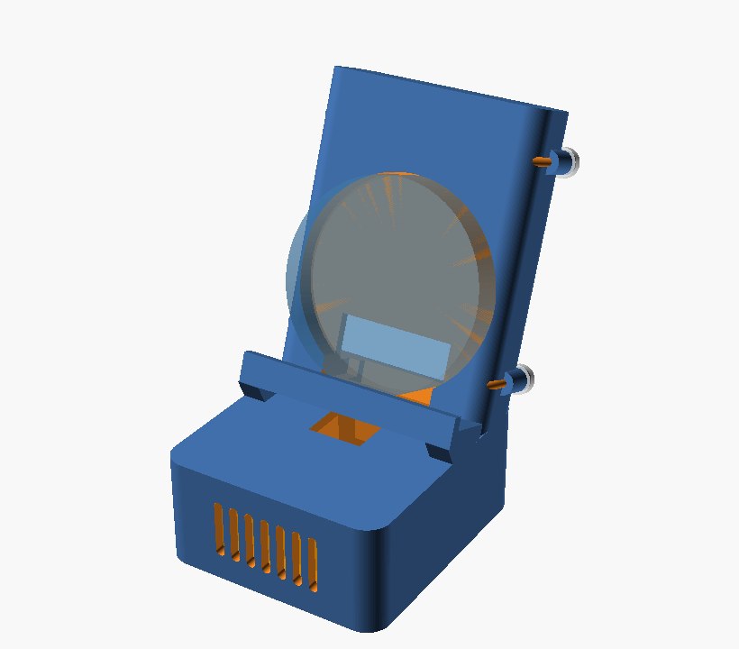

# Desk stand — ESP32-S3-Touch-AMOLED-1.75

A desk dock for the cased puck: it leans back 20°, carries the 3000 mAh pack
inside the backboard, fires a 2030 cavity speaker forward out of the plinth,
and lets the downward-facing USB-C stay plugged in.



| | |
| --- | --- |
| Footprint | 57.4 × 86.8 mm |
| Height | 99.0 mm |
| Tilt | 20° back from vertical |
| Parts | stand body + battery hatch |

## How it holds the device

The puck drops into a 5 mm circular recess and stands on a shelf, so nothing
overlaps the glass and it lifts straight out — no ring, no clip. 7 mm of the
12.1 mm case stays proud on both sides to grab.

The USB-C port points down, so the shelf has a 14 × 10 mm slot cut through it.
The plug passes through the slot into a channel that runs down the front of the
backboard, through the plinth, and out of the back. **The cable goes in and out
with the device seated** — nothing has to be lifted to charge.

## Bill of materials

| Item | Spec |
| --- | --- |
| Device | ESP32-S3-Touch-AMOLED-1.75, cased version, Ø51.0 × 12.1 mm |
| Battery | 655063 LiPo, 3.7 V 3000 mAh, 6.5 × 50 × 63 mm, MX1.25-2P, 50 mm lead |
| Speaker | 2030 cavity speaker, 8 Ω 2 W, 20 × 30 × 6.8 mm, PH1.25-2P, 120 mm lead |
| Screws | 4 × M2 × 6 self-tapping, for the battery hatch |
| Feet | 4 × Ø9 × 1.2 mm silicone pads (recesses are in the base) |

The battery lead is only 50 mm, which is why the pack sits directly behind the
device rather than in the base — the connectors are on the back of the board.

## Printing

```
part = "body"   -> stand_body.stl
part = "cover"  -> battery_cover.stl
```

- Material: PETG preferred. PLA warps if the stand ever sits in a car.
- Layer height 0.2 mm, 3 walls, 20 % infill.
- Print the body standing on its base, as modelled. The backboard leans at 20°,
  which is within overhang limits, and the shelf has a 45° gusset underneath,
  so **no supports are needed**.
- The hatch prints flat.

## Assembly

1. Feed the speaker lead through the pass-through at the back of the speaker
   pocket, then press the speaker into the pocket, mouth against the grille.
2. Drop the pack into the bay from the back. Route its lead down through the
   opening at the foot of the bay into the plinth.
3. Bring both leads up through the window in the recess floor and plug them
   into the back of the device.
4. Seat the device: bottom edge on the shelf, back into the recess.
5. Fit the hatch with the four M2 screws. The vent slots face out.
6. Stick on the feet.

## Check before the final print

These came off product drawings and photos, not off the parts:

- **USB-C position** — the slot assumes the port is at bottom dead centre of
  the puck. If it sits off to one side, move `usb_slot_w` or shift the slot.
- **USB-C plug body** — `usb_slot_w = 14`, `usb_slot_d = 10`. Chunky cables with
  moulded strain relief need more.
- **Case diameter** — `device_od = 51.00` with `fit = 0.60`. Print the first
  one, try the puck, adjust `fit` before printing again.
- **Pack thickness** — `part_fit = 1.00` allows for the swelling a pouch cell
  develops in service. Do not reduce it.

A cheap way to check all four: print just the top 25 mm of the backboard and
shelf as a fit gauge before committing to the 6-hour print.

## Tuning

```scad
tilt = 20;          // 15 sits more upright, 25 is closer to a photo frame
recess_d = 5.00;    // deeper grips harder, but leaves less to grab
shelf_out = 14.00;  // shelf depth, front to back
fit = 0.60;         // clearance around the device
part_fit = 1.00;    // clearance around battery and speaker
```

## Runtime with this pack

3000 mAh against a measured ~90–190 mA (screen on, 50 % brightness) is roughly
16–33 hours, comfortably past the 8-hour target.

Charging is the thing to fix: the PMU's 200 mA charge current is 0.07C for this
pack and would take most of a day. `BATTERY_PACK_MAH` in `main.c` now drives the
charge current automatically — see the firmware commit that accompanies this
folder.
